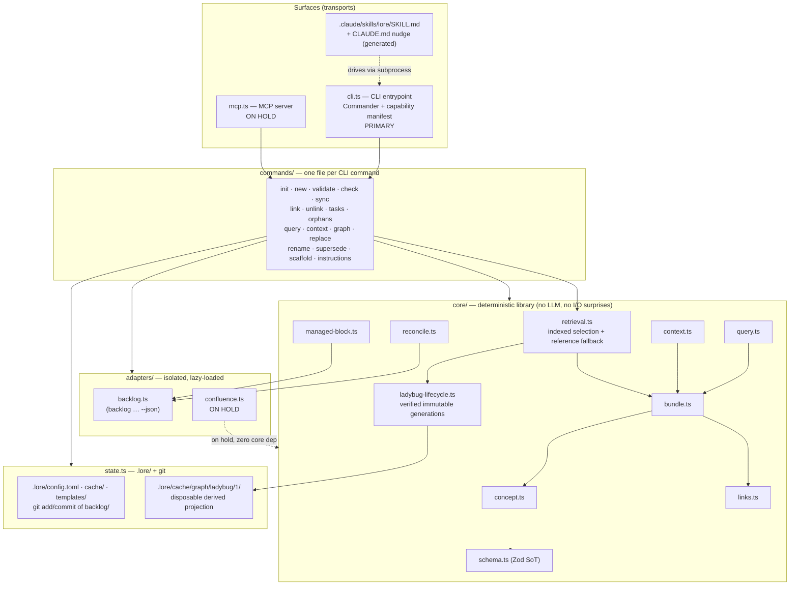

# System architecture

lore is a thin, OKF-native documentation CLI that couples repo-resident docs to
[Backlog.md](backlog-cli-contract.md) tasks and serves them to agents and humans.
This document describes how the pieces fit together: the layering, each module's
responsibility, the data flow for the key commands, and the agent bridge. It is
the map; the [design spec](../specs/lore-design.md) is the territory.

The governing principles — repeated here because they shape every boundary below
— are: **thin** (no reimplementation of Backlog.md, Confluence, or downstream
renderers), **zero-config**, **repo-is-source-of-truth**, **CLI-primary**,
**agent/CI-safe** (non-interactive, idempotent, semantic non-zero exit codes),
and a **deterministic core with no LLM dependency**
(see [ADR-0014](../adr/0014-core-has-no-llm-dependency.md)).

## 1. Layers at a glance

lore is four layers. Dependencies point downward only; nothing in a lower layer
knows about a higher one.



| Layer | What lives here | Knows about |
|---|---|---|
| **Surfaces** | `cli.ts` (primary), `mcp.ts` (on hold), generated `SKILL.md` + CLAUDE.md nudge | commands |
| **Commands** | `commands/*.ts` — argument parsing glue, output formatting, exit codes | core, state, adapters |
| **Core** | `concept`, `bundle`, `managed-block`, `reconcile`, `links`, `query`, `context`, `retrieval`, `ladybug-*`, `schema` | schema; repository reads; the backlog adapter; the private lazy native boundary |
| **State** | `state.ts` — `.lore/` read/write; lore as sole git committer of `backlog/` | filesystem, git |
| **Adapters** | `backlog.ts` (JSON), `confluence.ts` (on hold) | external processes / HTTP only |

The shape mirrors spec [§8 project structure](../specs/lore-design.md), with two
deliberate departures driven by the locked decisions: the Backlog adapter is
**JSON-only** (no `--plain` text parser — see §3), and the **MCP server is
secondary and on hold** (see §6). The active M6 LadybugDB projection is derived
state below the existing command contract, not a new source of truth.

## 2. The CLI is primary

`cli.ts` uses exact-pinned [Commander](tech-stack.md) for parsing and subcommand
selection. The capability manifest supplies the command catalog, positional
signatures, global flags, command flags, aliases, and generated Lore help; a
data-driven handler registry connects those declarations to `commands/*.ts`.
The command result is rendered in one of three output modes with strict precedence
`--json > --plain > pretty`:

- **pretty** — color on a TTY, the default for humans;
- **--plain** — ANSI-free stable text, auto-selected when stdout is not a TTY;
- **--json** — a versioned `{schemaVersion, kind, data}` envelope.

Semantic exit codes (`0` ok, `2` usage, `3` not-found, `4` denied, `5`
conflict/exists, `6` validation-or-drift) and the `--json` error envelope
(`{error_type, message, hint, input}` on stderr; stdout carries data only) are
the machine contract — see [CLI contract](cli-contract.md) and
[ADR-0005](../adr/0005-cli-contract.md). The full command list is the
[CLI surface](cli-surface.md).

`output.ts` is the shared rendering seam. Exact-pinned `string-width` owns
Unicode grapheme segmentation and terminal display-column measurement for the
task-summary rows shared by `tasks` and `orphans`. Lore sanitizes fields before
measurement, retains the column-padding and row-composition policy, and owns
all JSON/plain/pretty, stream, color, exit, and ordering contracts.

Commands are thin. A handler parses flags, calls one or more **core** functions
(which do the real work and return plain data structures), then formats. Handlers
never embed business logic that a future MCP tool would need to reimplement —
that logic lives in core, so the deferred MCP transport (§6) is genuinely the
*same code* behind a different door.

Commander does not move business rules or process lifecycle into the surface
layer. Every invocation builds a local program with `exitOverride()` and
injected no-op Commander writers; parser failures are translated into
`LoreError` before Lore's output seam renders them. Command handlers remain
adapters over structured core inputs and results, while injected streams,
semantic exit codes, JSON envelopes, TTY behavior, and `NO_COLOR` stay
Lore-owned.

## 3. The Backlog.md adapter (`adapters/backlog.ts`)

The single boundary to Backlog.md. It is **JSON-only**: lore invokes
`backlog task list --json`, `backlog task view <id> --json`, and
`backlog search --json`, and `JSON.parse`s a canonical
`{schemaVersion, kind, data}` envelope. There is **no `--plain` text-parser
fallback** — that omission is deliberate
([ADR-0002](../adr/0002-backlog-integration-json-only.md)).

> **The sketch below is illustrative, not authoritative — it predates the
> LCLI-54 migration and does not track the current adapter.** It omits
> `labels` from `listTasks`'s filter options and the `searchTasks` capability
> entirely, and gives `BacklogTask` a `file` field the real `task list`/
> `search` JSON summaries do not carry (see
> [backlog-json-schema.md §4](backlog-json-schema.md#4-kind-task-list),
> "No path field" — only `task view` carries a path, under the `file`/`path`
> key). It also still reflects the **pre-migration fork-based integration**
> (a compiled fork consumed as a git dependency, and `task view` exiting `0`
> on a missing task) — superseded, since `lore` now consumes upstream
> `MrLesk/Backlog.md` directly, and `task view <missing>` exits `1`. The
> "Reads"/"Writes" bullets below have already been corrected in place for the
> current integration (see
> [backlog-cli-contract.md §2.2](backlog-cli-contract.md#22-existence-checks--task-views-exit-code-is-meaningful)
> for the exit-code contract they cite).
> For the authoritative adapter surface, read `src/adapters/backlog.ts`
> directly; for the operational contract, read
> [backlog-cli-contract.md](backlog-cli-contract.md) and
> [backlog-json-schema.md](backlog-json-schema.md).

```ts
interface BacklogTask {
  id: string;          // "task-42"
  title: string;
  status: string;      // "To Do" | "In Progress" | "Done" | custom
  assignees: string[];
  labels: string[];    // includes lore back-references, e.g. "doc:stories/bulk-archive"
  file: string;        // path under backlog/tasks/
}

interface BacklogAdapter {
  probe(): Promise<{ version: string; jsonCapable: boolean }>; // enforces a MIN version, fail-loud
  listTasks(opts?: { status?: string }): Promise<BacklogTask[]>;
  viewTask(id: string): Promise<BacklogTask | null>;          // null when missing — never trust exit code
  searchByLabel(label: string): Promise<BacklogTask[]>;       // e.g. doc:<conceptId> back-refs
  createTask(input: { title: string; labels?: string[] }): Promise<string>; // returns the new id
  editTask(id: string, patch: { addLabels?: string[]; removeLabels?: string[]; status?: string }): Promise<void>;
}
```

Critical implementation rules, each from a locked decision:

- **Reads** go through the `--json` envelope. Stock Backlog.md lacked
  `--json` prior to upstream PR #790; `lore` now consumes upstream
  `MrLesk/Backlog.md` pinned at or past that merge commit (see
  [backlog-cli-contract.md](backlog-cli-contract.md) for the current pin and
  [the patch runbook](../runbooks/backlog-json-patch.md) for how the feature
  was upstreamed). See the [Backlog JSON schema](backlog-json-schema.md) for
  the envelope and the [Backlog CLI contract](backlog-cli-contract.md) for
  the invocation surface.
- **Capability probe** runs once at startup, caches in `.lore/cache/`, enforces a
  minimum `--json`-capable version, and **fails loud** rather than silently
  mis-parsing.
- **Writes** go through `backlog task create` / `backlog task edit` only — never a
  direct write to `backlog/tasks/*.md`. New task IDs are captured by parsing the
  `Created task <ID>` line. Existence **is** checked via `task view`'s exit
  code: it exits `1` unconditionally when the task is missing (see
  [backlog-cli-contract.md §2.2](backlog-cli-contract.md#22-existence-checks--task-views-exit-code-is-meaningful)).
- **Back-references** from a task to a doc are stored as a queryable label
  `doc:<conceptId>` (plus a `--doc` display affordance), because Backlog.md
  **drops unknown frontmatter keys on edit** — so lore never stores its own
  metadata on tasks. See
  [ADR-0009](../adr/0009-story-task-coupling-reconciliation.md).

### 3.1 Git ownership of `backlog/`

lore configures Backlog with `auto_commit=false` and becomes the **sole
committer** of `backlog/`: it `git add`/`commit`s task files itself after writes,
sets `check_active_branches=false` and `remote_operations=false`, and gitignores
`backlog/.locks/`. This keeps a single, predictable committer and avoids
Backlog.md racing lore's own commits. Details in
[ADR-0012](../adr/0012-backlog-coexistence-git-ownership.md), implemented in
`state.ts`.

## 4. The core library (`core/`)

The core is pure, deterministic, and testable in isolation. Same inputs →
byte-identical outputs (the property that makes agent loops and CI gates safe).

| Module | Responsibility |
|---|---|
| `profile.ts` / `schema.ts` | `.lore/profile.toml` is the declarative type source of truth. Lore compiles it into per-type Zod validators, emits Draft-7 JSON Schema via `z.toJSONSchema()`, and injects the `# yaml-language-server: $schema=…` modeline for editor autocomplete while retaining OKF tolerance. See [ADR-0006](../adr/0006-schema-types-templates.md). |
| `concept.ts` | Frontmatter ⇄ object. Owns fence/body splitting and uses exact-pinned `js-yaml` under a frozen configuration, validates frontmatter against generated Zod schemas, and serializes back **stably** so unchanged docs reach a byte-identical fixpoint — [ADR-0011](../adr/0011-frontmatter-serialization-stability.md). User-defined types and custom keys pass through untouched. |
| `bundle.ts` | Walks `docs/`, loads every concept, and builds the reference in-memory **bundle graph** (nodes = concepts, edges = cross-links + frontmatter refs). Generates the root `index.md`, sub-index files, and `log.md`. Computes per-doc / per-bundle token **estimates** (chars/4 heuristic, labeled). It remains the conformance oracle and fallback for retrieval and the direct substrate for mutation commands. |
| `managed-block.ts` | mdast-based surgery (via `mdast-util-from-markdown`, never `remark`) on the `<!-- lore:tasks:begin -->…<!-- lore:tasks:end -->` region of a Story. Regenerates the live task table from the Backlog adapter; **idempotent** (no upstream change → byte-identical output). Hand edits inside the markers are overwritten; everything outside is preserved. See [ADR-0008](../adr/0008-managed-block-remark-ast.md). |
| `reconcile.ts` | Status rules. Rolls a Story's `status` up from its tasks (all Done → `done`; any In Progress → `in-progress`; else if tasks exist → `todo`; no tasks → author's value). `sync` writes the result; `check` reports drift without writing. See [ADR-0009](../adr/0009-story-task-coupling-reconciliation.md). |
| `links.ts` | OKF cross-link normalization and rewriting. Enforces the lore link form — **relative, URL-encoded, `.md`-suffixed, no leading slash** — and powers `rename`/`supersede` inbound-link rewrites plus `replace`. See [ADR-0010](../adr/0010-multi-consumer-docs-layer.md). |
| `check.ts` | Resolves internal links against the whole bundle, validates fragments against headings, and runs the portability lint over the shared mdast tree. Exact-pinned `github-slugger` owns only GitHub-compatible slug and per-document duplicate state; Lore retains mdast heading-text extraction, link policy, findings, and output. |
| `query.ts` | Deterministic lexical retrieval (BM25-style) over a `BundleGraph`, plus frontmatter-field filters. The graph may come from a verified projection or the reference loader; scoring and tie-breaking are identical. **No vectors, no RAG, no chunking** — [ADR-0018](../adr/0018-persistent-local-graph-projection-with-ladybugdb.md). |
| `context.ts` | Deterministic, depth-bounded **graph-expansion export** for a concept id with a `--max-tokens` budget: full body of the target concept plus one-line `summary` neighbors, walking the bundle graph. No ranking heuristics. |
| `retrieval.ts` / `ladybug-native.ts` | Selects a fully verified indexed `BundleGraph` or the reference fallback before output begins. The exact Ladybug compatibility facts and platform gate are import-safe; `@ladybugdb/core` is dynamically evaluated only after a supported indexed operation is selected. |
| `ladybug-source.ts` / `ladybug-lifecycle.ts` / `ladybug-driver.ts` | Builds the export-1.0 source snapshot, classifies and reconciles immutable content-addressed generations, verifies native metadata and structure read-only, and reconstructs Lore concepts and authored edges from canonical source records. Cypher, physical schema, database paths, and native ids stay private. |

`state.ts` sits beside core: it reads/writes `.lore/` (`config.toml`, `cache/`,
`templates/`) per [ADR-0013](../adr/0013-lore-state-directory.md) and performs the
git operations for `backlog/` ownership (§3.1).

`config.ts` reads and parses `.lore/config.toml` with Bun, then uses reusable
loose Zod schemas for the generic parsed table/primitive shape. Lore code
retains recursive committed-token scanning, environment overlay,
defaults/snake-case projection, reserved override-key defense, page-id value
and precision rules, failure precedence, and the credential-safe error model.

## 5. Data flow for the key commands

Each command is a short pipeline: surface → command handler → core (+ adapter) →
formatted output + exit code. The flows below trace the load-bearing ones.

### `lore init`
`commands/init` → `state.ts` scaffolds `.lore/` (config, schemas, templates) and
`bundle.ts` writes a minimal `docs/index.md` carrying `okf_version: "0.1"` (the
**only** file with that key — [ADR-0003](../adr/0003-okf-substrate.md)). Idempotent:
re-running on an existing bundle is a no-op, not an error. On a bare invocation
with both stdin and stderr as TTYs, this same command also runs a TTY-gated
wizard that folds in `commands/agents`, `commands/scaffold`, and a backlog
capability probe — [ADR-0017](../adr/0017-interactive-init-wizard-tty-gated.md).

### `lore new <type> "<title>"`
`commands/new` → `schema.ts` (resolve the type) + a `.lore/templates/<type>.md`
template with `{{placeholder}}` substitution and `--var k=v` overrides →
`concept.ts` serializes the new file with valid frontmatter (`type`, `title`,
`description`, `tags`, `summary`, ISO `timestamp`) and the modeline. The new
concept is **not** committed automatically; it is yours to edit.

### `lore validate`
`commands/validate` → `bundle.ts` loads all concepts → `schema.ts` + `concept.ts`
apply the **tiered** check (OKF §9 conformance = error; per-type frontmatter
shape + required sections = error; unknown type + extra keys = WARNING) plus
frontmatter quote-safety. Exit `6` on any error tier. See
[validation reference](../adr/0007-validation-and-coherence.md) and the
[OKF conformance notes](okf-conformance.md).

### `lore sync` (writes)
`commands/sync` → `bundle.ts` loads → for each Story, `backlog.ts` fetches live
tasks → `reconcile.ts` recomputes `status` and `managed-block.ts` regenerates the
task table → `concept.ts` serializes changed docs and `bundle.ts` regenerates
indexes/log → `state.ts` commits `backlog/` if any task write occurred. Idempotent
end to end: a clean tree produces no diff.

### `lore check` (read-only, the CI gate)
`commands/check` → the **same** reconcile + managed-block + link/anchor
computation as `sync`, but **diffs instead of writing**. Reports status drift,
stale managed blocks, broken internal links, missing heading anchors, and
portability-lint findings. Internal links are validated by default; external
liveness is opt-in via `--external` (no Rust/lychee runtime dependency). Exit `6`
on drift. This is the gate CI runs.

### `lore link / unlink`
`commands/link` → `concept.ts` edits the Story's `tasks:` frontmatter
(doc → task) **and** `backlog.ts` adds/removes the `doc:<conceptId>` label on each
task (task → doc), then `state.ts` commits `backlog/`. `lore orphans` cross-checks
both directions: tasks with no owning doc, and docs whose referenced tasks have
vanished.

### `lore graph / query / context`
Commander dispatch injects `retrieval.ts` into the three existing thin handlers.
The resolver computes the current export fingerprint, follows the frozen
lifecycle policy, and either reads canonical concept/edge records from a fully
verified immutable generation or loads `bundle.ts` as the reference fallback.
Only then do the unchanged `graph.ts`, `query.ts`, and `context.ts` algorithms
shape the result, and only a complete result reaches Lore's emitter.

`query.ts` applies the same BM25 scoring, filters, limits, and code-unit
tie-breaking to either graph. `context.ts` performs the same nearest-first
depth walk and budget prefix. Public output does not reveal the selected backend.

### Agent profile context compiler

The singular `lore agent` family loads strict, committed
`.lore/agents/<name>.toml` mappings and compiles task-scoped evidence through a
pure core pipeline. Profiles constrain retrieval to explicit pinned and ranked
concept or heading references. The compiler reserves profile/catalog metadata,
includes mandatory pins, partitions long Markdown sources at heading and
top-level block boundaries, applies deterministic BM25 scoring only within the
allowed records, and fills the remaining chars-per-four budget with complete
provenance and omission accounting.

The command layer owns flags, rendering, task-file reads, and optional atomic
output. The core does not read native Claude Code or Codex agent files, call a
model, use a network, or spawn a worker. An orchestrator pack contains only its
own evidence plus a compact direct-delegate roster; each native worker invokes
the CLI independently for its own specialist profile. The plural `lore agents`
bridge command remains the separate native-guidance generator.

### M6 indexed read path

M6 keeps these command and core contracts and uses exact-pinned
`@ladybugdb/core@0.19.0` (storage version `43`) behind deterministic export
schema `1.0`. `graph`,
`query`, and `context` now consume a `BundleGraph` reconstructed from canonical
records in a fully verified read-only generation. The current in-memory loader
remains the conformance oracle and documented fallback. Git and OKF remain
authoritative; database files are ignored, disposable, immutable after
publication, and never returned as provenance.

The package/runtime/storage facts are part of the source fingerprint and
control manifest. Although the selected 0.19.0 runtime can read the former
storage-42 format, the 0.18.x to 0.19.0 transition is rebuild-only: Lore builds
and verifies a new immutable storage-43 generation and never upgrades a
published database in place.

The resolver applies the lifecycle decision before public output:

- reusable generations are verified read-only and served, including under a
  live writer lock when the exact generation remains safe;
- missing, stale, and known-incompatible generations rebuild under exclusive
  ownership;
- corrupt generations are never served and are quarantined only under that
  ownership before rebuild;
- active contention without an exact verified generation and newer unsupported
  formats use the in-memory fallback, preserving the unsupported bytes;
- any native build/read failure falls back before warnings or results are
  emitted, so partial indexed output is impossible.

Native loading stays behind an explicit lazy boundary. Importing the CLI,
Commander registry, lifecycle classifier, or fallback path does not evaluate
the addon. Bun 1.2.23 cannot safely load the Ladybug Windows addon in the test
process, so Windows selects the reference path before the loader; Windows
native packaging qualification remains `LCLI-283.1.4` scope. See
[ADR-0018](../adr/0018-persistent-local-graph-projection-with-ladybugdb.md) and
the [local graph roadmap](../specs/local-graph-platform-roadmap.md).

### `lore rename / supersede / replace`
Mutation commands continue to load `bundle.ts` directly. `rename` and
`supersede` rewrite **all inbound links and frontmatter refs** through the graph and set
`superseded_by`/`supersedes`/`status`; `replace` does literal/regex find-replace
(`--in` glob, `--dry-run`) and **skips lore-managed regions**.

## 6. The on-hold MCP transport (`mcp.ts`)

The MCP server is **secondary, retained, and on hold**. ADR-0004 records the original CLI-first deferral; [ADR-0018](../adr/0018-persistent-local-graph-projection-with-ladybugdb.md) removes it from the scheduled M6 slot. If reactivated, it remains only a transport: each MCP tool wraps the same core functions as the CLI with no duplicated logic or second source of truth. The retained contract is documented in the [MCP tools reference](mcp-tools.md). No M6–M8 task depends on MCP.

## 7. The agent bridge (primary, today)

While the MCP transport remains on hold, the agent surface is the CLI plus three generated
artifacts that teach an agent to drive it:

- **`.claude/skills/lore/SKILL.md`** — a generated Claude Code skill describing
  the command surface, output modes, and exit codes, so Claude Code invokes
  `lore` as a subprocess and parses `--json`.
- **A tiny CLAUDE.md nudge** — a few lines pointing the agent at the skill and at
  `lore instructions`. (An `AGENTS.md` `@import` shim is deferred-not-dropped.)
- **`lore instructions`** — a command that prints the same orientation text on
  demand, for agents and humans alike.

This bridge, like the MCP server, drives the identical core through the CLI
contract — there is exactly one implementation of every behavior. See
[ADR-0004](../adr/0004-cli-first-skill-bridge-mcp-deferred.md) and the
[agent onboarding runbook](../runbooks/agent-onboarding.md).

## 8. Adapter isolation

Both adapters are isolated and lazy-loaded so the core never depends on them
beyond the two narrow seams it needs:

- **`backlog.ts`** is loaded whenever a command touches tasks (`sync`, `check`,
  `link`, `tasks`, `orphans`). It is the *only* place a `backlog` subprocess is
  spawned.
- **`confluence.ts`** is **deferred** (Cloud/ADF target; Server/DC
  deferred-not-dropped) and loaded *only* when `lore publish` is invoked. Core
  has **zero** Confluence dependency — [ADR-0016](../adr/0016-confluence-one-way-publish-deferred.md).

## See also

- [lore design spec](../specs/lore-design.md) — the full design, including spec §8 structure
- [Tech stack](tech-stack.md) — Bun, exact-pinned Commander with Lore-owned lifecycle/output, the `js-yaml` frontmatter boundary, mdast parsing, and Zod
- [Dependency boundary audit](dependency-boundary-audit.md) — focused package delegation, compatibility gates, future filesystem/frontmatter investigations, and retained Lore-owned behavior
- [CLI surface](cli-surface.md) and [CLI contract](cli-contract.md)
- [Backlog JSON schema](backlog-json-schema.md) and [Backlog CLI contract](backlog-cli-contract.md)
- [Consumer compatibility](consumer-compatibility.md) and [portable markdown](portable-markdown.md)
- [OKF conformance](okf-conformance.md) and [MCP tools (deferred)](mcp-tools.md)
- [Backlog JSON patch runbook](../runbooks/backlog-json-patch.md) and [agent onboarding](../runbooks/agent-onboarding.md)
- [Architecture decision records](../adr/index.md)
- Project root entry: [docs index](../index.md)
